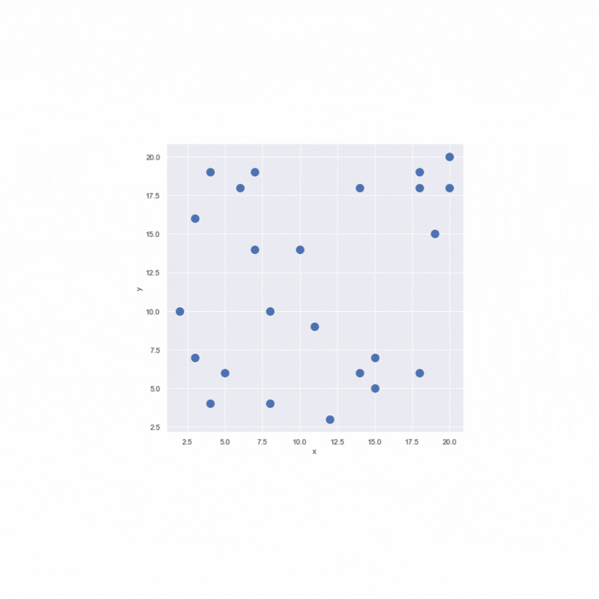

# LINO-PIMO-SIGO

## Qu'est-ce que LINO-PIMO ?

Des outils en ligne de commande :

* Conçus pour *créer*, *générer*, *gérer* et *anonymiser* les jeux de tests.
* Compatible avec une démarche *DevOps*.
* En adéquation avec la *philosophie Unix*.

**LINO** est un ETL spécialisé dans la gestion de jeux de données de tests. <br>
LINO extrait d'une base de données relationnelle un ensemble de données, liées par des contraintes de clés étrangères, sous la forme d'un flux *JSON*. <br>
LINO permet également le chargement d'un flux *JSON* dans une base de données existante.

**PIMO** est un outil d'anonymisation de données. <br>
Un flux de données au format *JSON* passé en entrée, peut être transformé en un autre flux dans lequel les données sensibles ont étés masquées par des valeurs aléatoires. <br>
Son puissant moteur de masquage permet de paramétrer finement quoi anonymiser dans le flux, et surtout comment grâce au fichier `masking.yml`. <br>
L'outil est également capable de générer de la volumétrie à partir d'une seule ligne d'exemple.

Ces outils peuvent s'exécuter sur tous types d'environnements (*Linux*, *Windows*, *MacOs*) et peuvent être manipulées facilement par un opérateur, un script ou un outil de CI/CD.

###  Aperçu Rapide

#### LINO


#### PIMO


### Cas d'Usage

* **Echantillonnage** : Fabriquer un jeu de données réduit avec des données cohérentes entre elles.
* **Pseudo-Anonymisation** : Remplacer les données personnelles en préservant le format.
* **Comparaison** : Aligner les données pour identifier les différences, trouver les suppressions.
* **Automatisation des tests** : Données calibrées, suppression des données à la fin du test.
* **Reproduction d'un BUG** : Rechercher une donnée, extraire toutes les entités nécessaires et recharger dans une base de test.
* **Synthèse** : Générer des données.


## PIMO vs SIGO

**PIMO** est un l'outil idéal pour faire de l'anonymisation lorsque l'objectif principal n'est pas de garder la "qualité" de la donnée, comme par exemple pour les jeux de tests. Lorsque l'on a besoin d'anonymiser des données dans le but de pouvoir tester une application, nous voulons que nos données restent conformes, que les règles métier qui définissent les données soient respectées (format conforme) et que la cohérence soit conservée, on souhaite qu'une même donnée présente dans plusieurs bases soit anonymisée de la même façon, et c'est ce qui est fait avec **LINO-PIMO**. <br>

Cependant la "qualité" de la donnée (pertinance, véracité, ...) n'est plus respectée. Si des données répertoriant des caractéristiques (tels que le poids, l'âge, ...) de patients atteints par différentes pathologies doivent être anonymisées, **PIMO** ne pourra pas garder les corrélations qu'il peut y avoir entre le poids et la pathalogie par exemple. C'est dans ce contexte que l'utilisation de **SIGO** peut être utile. <br>  

Les données de "bonnes qualités" garantissent l'utilisabilité de celles-ci, ce qui sous-entend pouvoir réutiliser les données pour faire de l'analyse, répondre à un objectif ou un problème à l'aide d'IA, ...

## Qu'est-ce que SIGO ?

* Conçus pour *anonymiser* des jeux de données où l'information contenue dans les données est importante.
* Compatible avec une démarche *DevOps*.
* En adéquation avec la *philosophie Unix*.

**SIGO** est un outil d'anonymisation de données respectant les principes du k-anonymat et de la l-diversité. <br>
Un jeu de données au format *JSON* passé en entrée, peut-être transformé en un autre jeu de données également au format *JSON* dans lequel les données auront été anonymisées en utilisant différentes méthode comme par exemple l'aggrégation ou l'ajout de bruit. <br>
L'objectif de cet outil est d'empêcher la réidentification des individus tout en préservant l'utilité des données. 

Il faut noter qu'il est impossible de garantir une anonymisation offrant un risque nul de réidentification, encore plus si l'on veut assurer l'utilisabilité des données. **SIGO** est un compromis entre ces 2 enjeux majeurs: l'anonymisation (diminuation des risques liés à la réidentificaition) et l'utilisabilité des données.

###  Aperçu Rapide


### Cas d'Usage

* **Publication**: Publier des données dans l'Open Data contenant des données sensibles. Pour être conforme au RGPD les données doivent être préalablement anonymisées.
* **Utilisation d'IA**: Les Data Scientist peuvent entraîner des modèles de machine learning sur des jeux de données contenant des données sensibles. Pour limiter les risques, il est possible d'anonymiser les données.
* **Analyse**: De même concernant les personnes qui analysent des données contenant des donées sensibles.

### Notions clés

Un **enregistrement** est une ligne d'une table de base de données contenant les informations lié aux différents champ. 
Les enregistrements permettent de stocker les éléments d’information individuels. Chaque enregistrement est constitué d’un ou plusieurs champs. Les champs correspondent aux colonnes d’une table. <br>

Par exemple : 
```json
{"nom": "Dupont", "prenom": "Jean", "age": 71, "taille": 1.72, "poids": 86} 
```

|  identifiant | quasi-identifiant | sensible |
|--------------|-------------------|----------|
| nom + prenom |    age + taille   |   poids  |

- **identifiant:** Attribut qui identifie un enregistrement de façon unique
 (par exemple, un numéro de sécurité sociale, un prénom, un nom).

- **quasi-identifiant: (QI)** Ensemble d'attributs qui peuvent être utilisé pour identifier, de façon indirect, un enregistrement avec une forte probabilité (en liant ces attributs à des sources externes de données, par exemple {sexe, code postal, date de naissance} forme un quasi-identifiant connu dans de nombreux ensembles de données). 

- **sensible**: Attribut que l'on veut conserver secret (par exemple données médicales, salaires). 

- **non sensible:** Attribut qui n'entre dans aucune des catégories ci-dessus. <br>
<br>

- **k-anonymat:** Ce modèle offre l’assurance que chaque n-uplet de valeurs de quasi-identifiants apparaît au moins k fois dans la table à publier.

Ci-dessous une table respectant le 2-anonymat, {Age, Education} étant les quasi-identifiants et {Maladie} la donnée sensible :

|   Age   |  Education |  Maladie  |
|:-------:|:----------:|:---------:|
| [19,23] | secondaire | cardiaque |
| [19,23] | secondaire |   cancer  |
| [27,30] | secondaire |   grippe  |
| [27,30] | secondaire |   grippe  |
| [19,23] |  supérieur |   cancer  |
| [19,23] |  supérieur |   cancer  |
| [19,23] |  supérieur |   cancer  |

- **l-diversité:**  Le principe de la l-diversité est le suivant : `Une classe d’équivalence respecte la l-diversité s’il existe au moins l valeurs «bien représentées » pour l’attribut sensible. Une table respecte la l-diversité si chacune de ses classes d’équivalence respectent la l-diversité.`

Ci-dessous une table respectant la 3-diversité:

|   Age   |  Education |  Maladie  |
|---------|------------|-----------|
| [19,23] | secondaire | cardiaque |
| [19,23] | secondaire |   cancer  |
| [19,23] | secondaire |   grippe  |
| [19,23] | secondaire |   grippe  |
| [27,30] |  supérieur |   cancer  |
| [27,30] |  supérieur |   cancer  |
| [27,30] |  supérieur | cardiaque |
| [27,30] |  supérieur |   grippe  |

**SIGO** est un outils d'anonymisation respectant la `k-anonymisation` et la `l-diversité`.

- **SIGO** va construire des clusters en divisant l'ensemble des enregistrements en groupes contenant au moins k individus.
Il va prendre chaque dimension correspondant à un attribut du QI ordonner cette dimension et la découper en 2 "parts égales", jusqu'à ce que le découpage ne puisse plus se faire et que la condition sur la l-diversité est respectée.

- Puis **SIGO** anonymise chaque clusters en fonction d'une méthode d'anonymisation choisit par l'utilisateur. Comme par exemple `meanAggregation` où chaque attribut du cluster est remplacer par la moyenne des attributs du cluster.

