# Tutoriel 

## Avant de commencer

### Objectifs

Ce tutoriel a pour objectif de vous initier aux outils `lino` et `pimo`. A la fin de ce tutoriel vous pourrez :

* installer `lino` / `pimo` sur votre poste.
* configurer `lino` pour vous connecter à une base de données.
* extraire des données d'une base pour les recharger dans une autre.
* modifier certains champs pour anonymiser un flux de données.
* analyser les logs et les données en erreur.

### Prérequis

#### Compétences

Voici la liste des compétences indispensables :

* Connaissance et utilisation de Git.
* Connaissance et utilisation de la ligne de commande Linux et/ou Windows (PowerShell).
* Utilisation d'un éditeur de texte (Dans ce tutoriel nous utiliserons Visual Studio Code).
* Connaissance de YAML (Vous pouvez consulter ce [tutoriel YAML](https://learnxinyminutes.com/docs/yaml/)).

#### Outils

Pour ce tutoriel vous aurez besoin des outils suivants :

* un environnement "bash" (docker, linux, wsl2 ou git+bash) ou d'un "powershell". 
* vscode

### Environnement

Dans ce tutoriel nous allons utiliser l'application `PetClinic` composée de deux environnements:

* Environnement de Production:
    * SGBD : postgressql
    * Host : bdd
    * port : 5432
    * user : jhpetclinic
    * database: jhpetclinic
    * mot de passe : jhpetclinic
    * url : [localhost:8080](http://localhost:8080/owner)

* Environnement de Qualification:
    * SGBD : postgressql
    * Host : bdd
    * port : 5432
    * user : jhpetclinic
    * database : jhpetclinic
    * mot de passe : jhpetclinic
    * url : [localhost:8001](http://localhost:8001/owner)

Le schéma des données de l'application de prod et de qualification est le suivant :

.

## Installation

`lino` et `pimo` sont 2 outils écrit en **GO** et compilé nativement. L'installation consiste donc seulement à copier le binaire correspondant au système d'exploitation sous-jacent dans un répertoire. Il peut être utile ensuite de rendre ce répertoire accessible depuis la variable d'environnement PATH.

### LINO

Vous pouvez récupérer le binaire de `lino` sur la page [CGI-FR/LINO/releases](https://github.com/CGI-FR/LINO/releases), en choisissant la version et l'environnement qui convient.

* Sous Linux

```console
$ wget <url>/<file>.tar.gz --output-document lino.tar.gz
$ tar xzvf lino.tar.gz
$ lino --version
```

* Sous Windows 

```powershell
PS> Invoke-WebRequest <url>/<file>.tar.gz -OutFile lino.tar.gz
PS> Save-Module -Name 7Zip4Powershell -Path .
PS> Import-Module .\7Zip4Powershell\2.1.0\7Zip4Powershell.psd1
PS> Expand-7Zip lino.tar.gz .
PS> Expand-7Zip lino.tar .
PS> $env:Path += ";."
PS> lino --version
```

Vérifier l'installation avec la commande `lino --help`.


### PIMO

Vous pouvez récupérer le binaire de `pimo` sur la page [CGI-FR/PIMO/releases](https://github.com/CGI-FR/PIMO/releases), en choisissant la version et l'environnement qui convient.

* Sous Linux

```console
$ wget <url>/<file>.tar.gz --output-document pimo.tar.gz
$ tar xzf pimo.tar.gz
$ pimo --version
```

* Sous Windows 

```powershell
PS> Invoke-WebRequest <url>/<file>.tar.gz -OutFile pimo.tar.gz
# Ne pas refaire cette manip si déjà fait pour lino
# PS> Save-Module -Name 7Zip4Powershell -Path .
# PS> Import-Module .\7Zip4Powershell\2.1.0\7Zip4Powershell.psd1
PS> Expand-7Zip pimo.tar.gz .
PS> Expand-7Zip pimo.tar .
PS> $env:Path += ";."
PS> pimo --version
```

Vérifier l'installation avec la commande `pimo --help`.

### Préparation de l'environnement 

Dans ce tutoriel, nous allons utiliser une application Spring Boot REST en backend et Angular en Frontend. Les données sont pré-chargées dans une base Postgres. Pour simplifier, nous utiliserons un environnement `docker-compose`.

Le fichier `docker-compose.yml` est le suivant:

```yaml
version: "3.3"

services:
  app:
    image: ag04/jhpetclinic:latest
    environment:
      _JAVA_OPTIONS: '-Xmx512m -Xms256m'
      SPRING_PROFILES_ACTIVE: 'prod,swagger'
      MANAGEMENT_METRICS_EXPORT_PROMETHEUS_ENABLED: 'true'
      SERVER_SERVLET_CONTEXT_PATH: '/'
      JHIPSTER_SLEEP: '5' # gives time for other services to boot before the application
      DATASOURCE_URL: 'jdbc:postgresql://bdd:5432/jhpetclinic'
      JPA_DATABASE_PLATFORM: 'io.github.jhipster.domain.util.FixedPostgreSQL10Dialect'
      JPA_DATABASE: 'POSTGRESQL'
      DB_USER: 'jhpetclinic'
      DB_PWD: 'jhpetclinic'
      DB_NAME: 'jhpetclinic'
      DB_SCHEMA: 'public'
      MAIL_HOST: 'localhost'
      MAIL_PORT: 25
      MAIL_USERNAME: ''
      MAIL_PWD: ''
      MAIL_APP_BASE_URL: 'localhost:8080/'
    ports:
      - 8080:8080
    depends_on:
      - bdd

  bdd:
    image: postgres:12.3
    environment:
      - POSTGRES_USER=jhpetclinic
      - POSTGRES_HOST_AUTH_METHOD=trust
    ports:
      - "5432:5432"
```

Pour lancer l'environnement, 
```console
$ docker-compose up -d app bdd
```

```console
Creating tutoriel-lino_bdd_1    ... done
Creating tutoriel-lino_app_1    ... done
```
-------------------------------------------
Pour information : pour faire un reset total de l'environnement,
```console
$ docker-compose stop app bdd 
$ docker-compose rm app bdd
```
-------------------------------------------

L'application démarre en installant des données dans la base. L'IHM est disponible [ici](http://localhost:8080).

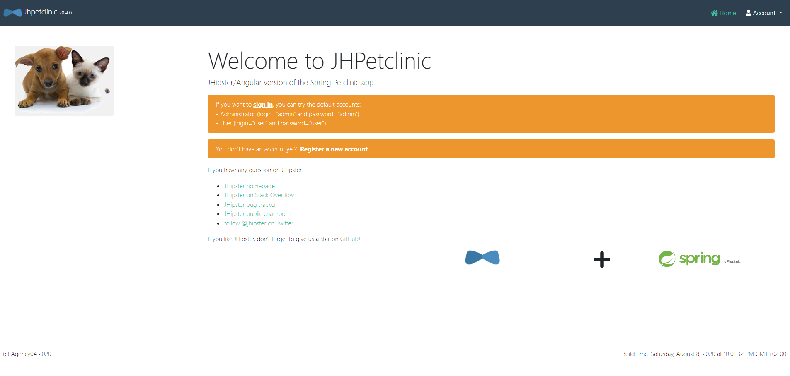

Pour se conncecter, il suffit d'aller sur *Account* -> *Sign in*, et de renseigner comme **Username** et comme **Password** `admin`.

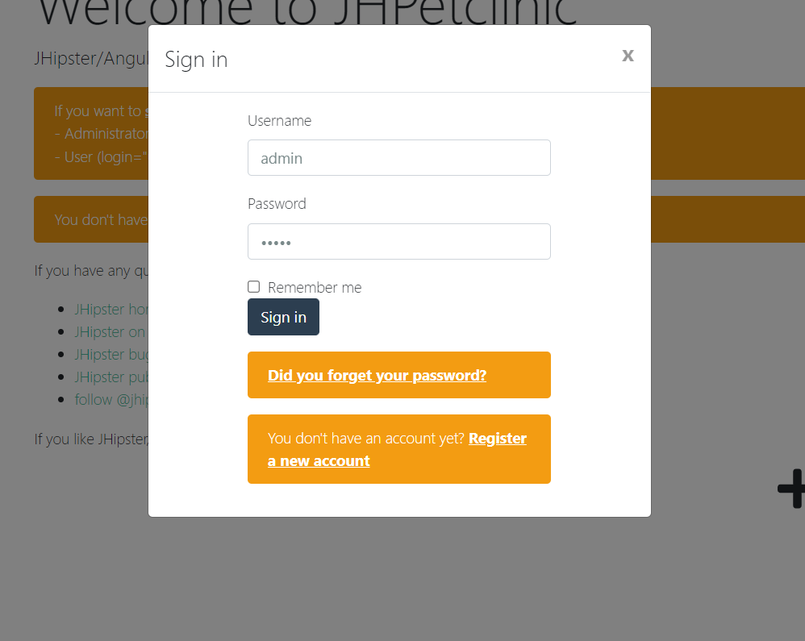

## LINO

### Connexion à une base de données

Pour gérer la configuration des bases de données on utilise la sous-commande `lino dataconnector` ou `lino dc`.

La documentation est disponible en lançant `lino dc --help`.

La commande `lino dc add <alias> <path_bdd> -p -u <user>` permet d'associer les coordonnées d'une base de données à un alias. 

```console
$ lino dc add source 'postgresql://localhost:5432/jhpetclinic?sslmode=disable' -p -u jhpetclinic
enter password:
successfully added dataconnector
```

L'attribut `-p` indique que vous allez passer le mot de passe à une invite de commande. Il est également possible de passer le mot de passe par variable d'environnement avec le paramètre `-P`.

`lino dc list` permet de lister les connecteurs.

```console
$ lino dc list 
{source postgresql://jhpetclinic@localhost:5432/jhpetclinic?sslmode=disable false  { } { }}
```

Pour tester la connexion avec la base de données on utilise la commande `lino dc ping <alias>`.

```console
$ lino dc ping source
ping success
```

La configuration se trouve dans le fichier `dataconnector.yml` dans le répertoire courant.

```yaml
version: v1
dataconnectors:
  - name: source
    url: postgresql://jhpetclinic@localhost:5432/jhpetclinic?sslmode=disable
    readonly: true
```

Vous pouvez éditer le fichier `dataconnector.yml` à la main pour modifier l'attribut readonly de la base source à true. Ceci bloque les commandes pouvant modifier le contenu de la base source.

### Extraire les schémas

`lino` est capable de lire les méta-données de la base pour extraire les tables du schéma et il est également capable de retrouver les relations entre les tables en explorant les contraintes de clés étrangères.

#### Extraction du schéma table

Pour extraire le schéma des tables on utilise la commande `lino table`.

La documentation est disponible en lançant `lino table --help`.

`lino table extract <alias>` permet d'extraire les informations des tables de la base de données `<alias>` dans un fichier `tables.yml` dans le répertoire courant.

```console
$ lino table extract source
lino finds 13 table(s)
```

Cette commande initialise le fichier `tables.yml` contenant la liste des tables qui se trouvent dans la base de données `source`.

```yaml
version: v1
tables:
  - name: databasechangeloglock
    keys:
      - id
  - name: jhi_authority
    keys:
      - name
  - name: jhi_persistent_audit_event
    keys:
      - event_id
  - name: jhi_persistent_audit_evt_data
    keys:
      - name
      - event_id
  - name: jhi_user
    keys:
      - id
  - name: jhi_user_authority
    keys:
      - user_id
      - authority_name
  - name: owners
    keys:
      - id
  - name: pets
    keys:
      - id
  - name: specialties
    keys:
      - id
  - name: types
    keys:
      - id
  - name: vets
    keys:
      - id
  - name: vets_specialties
    keys:
      - specialties_id
      - vet_id
  - name: visits
    keys:
      - id
```

#### Extraction du schéma relation

Pour extraire le schéma des relations on utilise la commande `lino relation`.

La documentation est également disponible en lançant `lino relation --help`.

`lino relation extract <alias>` permet d'extraire les informations des tables de la base de données `<alias>` dans un fichier `relation.yml` également dans le répertoire courant. Les relations sont initiées à partir de contraintes de clé étrangère.

```console
$ lino relation extract source
lino finds 8 relations from constraints
```

Cette commande initialise le fichier `relation.yml` contenant la liste des relations qui se trouvent dans la base de données `source`.
Chaque relation est décrite par un nom, une table parente avec sa clé primaire, une table enfant avec sa clé étrangère.

```yaml
version: v1
relations:
  - name: fk_authority_name
    parent:
      name: jhi_authority
      keys:
        - name
    child:
      name: jhi_user_authority
      keys:
        - authority_name
  - name: fk_user_id
    parent:
      name: jhi_user
      keys:
        - id
    child:
      name: jhi_user_authority
      keys:
        - user_id
  - name: fk_evt_pers_audit_evt_data
    parent:
      name: jhi_persistent_audit_event
      keys:
        - event_id
    child:
      name: jhi_persistent_audit_evt_data
      keys:
        - event_id
  - name: fk_vets_specialties_vets_id
    parent:
      name: vets
      keys:
        - id
    child:
      name: vets_specialties
      keys:
        - vet_id
  - name: fk_vets_specialties_specialties_id
    parent:
      name: specialties
      keys:
        - id
    child:
      name: vets_specialties
      keys:
        - specialties_id
  - name: fk_pets_type_id
    parent:
      name: types
      keys:
        - id
    child:
      name: pets
      keys:
        - type_id
  - name: fk_pets_owner_id
    parent:
      name: owners
      keys:
        - id
    child:
      name: pets
      keys:
        - owner_id
  - name: fk_visits_pet_id
    parent:
      name: pets
      keys:
        - id
    child:
      name: visits
      keys:
        - pet_id
```

Si des relations fonctionnelles ne sont pas modélisées par des contraintes dans la base de données alors il est possible d'ajouter des relations à la main en éditant le fichier `relations.yml`.

### Extraire des données

La commande `lino pull` est utilisé pour extraire des données de la base au format **JSONline** (Un objet JSON par ligne).

Pour plus de détail consultez l'aide `lino pull --help`.

#### Extraction des données d'une table

Le paramètre `--table` permet de spécifier le nom de la table à extraire. Par exemple, nous pouvons récupérer les données de la table `pets` avec la commande suivante :

```console 
$ lino pull --table pets source -l 1
{"birth_date":"2000-09-07T00:00:00Z","id":1,"name":"Leo","owner_id":1,"type_id":1}
```

Le paramètre `-l` permet de limiter le nombre de résultats en sortie (par défaut il est paramétré à 1 et `-l 0` permet de retourner tous les résultats).

#### Extraction d'une entité sur plusieurs tables

`lino` permet d'extraire un sous ensemble cohérent d'animaux de la base de données. Pour ce faire `lino` a besoin de connaître la table de départ et les relations qu'ils doit suivre pour extraire un ensemble fonctionnellement cohérent.

**1. Création d'un ingress-descriptor**

L'objet `ingress descriptor` ou `id` décrit le chemin que doit suivre `lino` pour extraire les données. Pour plus de détail consultez l'aide `lino id --help`.

La commande `lino id create <table>` permet d'initialiser un `ingress descriptor`.

```console
$ lino id create pets
successfully created ingress descriptor
```

Un fichier `ingress-decriptor.yml` est généré contenant le nom de la table de départ et les relations qui peuvent être atteintes depuis cette table.

```yaml
version: v1
IngressDescriptor:
  startTable: pets
  relations:
    - name: fk_pets_type_id
      parent:
        name: types
        lookup: false
      child:
        name: pets
        lookup: false
    - name: fk_pets_owner_id
      parent:
        name: owners
        lookup: false
      child:
        name: pets
        lookup: false
    - name: fk_visits_pet_id
      parent:
        name: pets
        lookup: false
      child:
        name: visits
        lookup: true
```

La commande `display-plan` permet de connaître le plan d'extraction de `lino` sans faire l'extraction.

```console
$ lino id display-plan
step 1 - pull rows from pets
step 2 - pull rows from visits following →fk_visits_pet_id relationship for rows pulled at step 1
```

- Extraction des relations

Si on veut également extraire les propriétaires d'animaux il faut sélectionner la relation dans le fichier `ingress-descriptor.yml`.

```yaml
- name: fk_pets_owner_id
    parent:
        name: owners
        # sélection de la relation dans le sens pets -> owners
        lookup: true
    child:
        name: pets
        lookup: false
```

Dans le plan, `lino` indique bien qu'il va rechercher les informations des propriétaires.

```console
$  lino id display-plan
step 1 - pull rows from pets
step 2 - pull rows from owners following ←fk_pets_owner_id relationship for rows pulled at step 1
step 3 - pull rows from visits following →fk_visits_pet_id relationship for rows pulled at step 1
```

Il est également possible d'extraire les informations du type d'animal (chat, poisson, lapin). Mais on peut également considérer cette table comme une table de référence qui est une configuration de l'application et pas une donnée fonctionnelle.

**2. Extraction d'un animal**

Pour extraire une grappe d'information cohérente on utilise la commande `lino pull <alias>`.

L'extraction va construire un objet *JSON* imbriqué contenant les informations de l'animal et de propriétaire sur un niveau inférieur.

```console
$ lino pull source --limit 1
{"birth_date":"2000-09-07T00:00:00Z","fk_visits_pet_id":[],"id":1,"name":"Leo","owner_id":1,"type_id":1}
```

Le résultat est un enregistrement au format *JSON* écrit directement sur la sortie standard.

Il est possible d'utiliser des utilitaires annexes pour le mettre en forme.

```console
$ lino pull source | jq
```

```json
{
  "birth_date": "2000-09-07T00:00:00Z",
  "fk_pets_owner_id": {
    "address": "110 W. Liberty St.",
    "city": "Madison",
    "first_name": "George",
    "id": 1,
    "last_name": "Franklin",
    "telephone": "6085551023"
  },
  "fk_visits_pet_id": [],
  "id": 1,
  "name": "Leo",
  "owner_id": 1,
  "type_id": 1
}
```

On peut également mettre le résulat dans un fichier annexe.

```console
$ lino pull source > leo.json
$ cat leo.json
{"birth_date":"2000-09-07T00:00:00Z","fk_visits_pet_id":[],"id":1,"name":"Leo","owner_id":1,"type_id":1}
```

#### Extraction de plusieurs entités

`lino` peut extraire plusieurs enregistrements. Pour faciliter le traitement en *stream*, chaque ligne contient un objet *JSON* (*JSON Line*).

```console
$ lino pull source --limit 3
{"birth_date":"2000-09-07T00:00:00Z","fk_pets_owner_id":{"address":"110 W. Liberty St.","city":"Madison","first_name":"George","id":1,"last_name":"Franklin","telephone":"6085551023"},"fk_visits_pet_id":[],"id":1,"name":"Leo","owner_id":1,"type_id":1}
{"birth_date":"2002-08-06T00:00:00Z","fk_pets_owner_id":{"address":"638 Cardinal Ave.","city":"Sun Prairie","first_name":"Betty","id":2,"last_name":"Davis","telephone":"6085551749"},"fk_visits_pet_id":[],"id":2,"name":"Basil","owner_id":2,"type_id":6}
{"birth_date":"2001-04-17T00:00:00Z","fk_pets_owner_id":{"address":"2693 Commerce St.","city":"McFarland","first_name":"Eduardo","id":3,"last_name":"Rodriquez","telephone":"6085558763"},"fk_visits_pet_id":[],"id":3,"name":"Rosy","owner_id":3,"type_id":2}
```

#### Extraction filtrée

Il est possible d'ajouter des critères pour filtrer la table de départ à l'aide du paramètre `--filter, -f` pour des critères d'égalités ou `--where, -w` pour des *clauses where SQL* avancées.

```console
$ lino pull source --filter type_id=4 --limit 1
{"birth_date":"2000-01-20T00:00:00Z","fk_pets_owner_id":{"address":"2387 S. Fair Way","city":"Madison","first_name":"Peter","id":5,"last_name":"McTavish","telephone":"6085552765"},"fk_visits_pet_id":[],"id":6,"name":"George","owner_id":5,"type_id":4}
```

```console
$ lino pull --table owners source -w "id in (1,2,8)" -l 3
{"address":"110 W. Liberty St.","city":"Madison","first_name":"George","id":1,"last_name":"Franklin","telephone":"6085551023"}
{"address":"638 Cardinal Ave.","city":"Sun Prairie","first_name":"Betty","id":2,"last_name":"Davis","telephone":"6085551749"}
{"address":"345 Maple St.","city":"Madison","first_name":"Maria","id":8,"last_name":"Escobito","telephone":"6085557683"}
```

Si on veut extraire une série d'enregistrement basé sur une liste arbitraire de critère. Il est possible de passer cette liste sous la forme d'un fichier *JSON Line* à `lino` à l'aide du paramètre `--filter-from-file, -F`.

* Sous Linux:

```console
$ cat > filter.jsonl <<EOF 
heredoc> { "id" : 1 }
heredoc> { "id" : 4 }
heredoc> { "id" : 5 }
EOF
{"id": 1}
{"id": 4}
{"id": 5}
```

* Sous Windows:

```powershell
PS> echo '{ "id" : 1 }' > filter.jsonl
PS> echo '{ "id" : 4 }' >> filter.jsonl
PS> echo '{ "id" : 5 }' >> filter.jsonl
PS > cat filter.jsonl
{"id": 1}
{"id": 4}
{"id": 5}
```

```
$ lino pull -F filter.jsonl source
{"birth_date":"2000-09-07T00:00:00Z","fk_pets_owner_id":{"address":"110 W. Liberty St.","city":"Madison","first_name":"George","id":1,"last_name":"Franklin","telephone":"6085551023"},"fk_visits_pet_id":[],"id":1,"name":"Leo","owner_id":1,"type_id":1}
{"birth_date":"2000-03-07T00:00:00Z","fk_pets_owner_id":{"address":"2693 Commerce St.","city":"McFarland","first_name":"Eduardo","id":3,"last_name":"Rodriquez","telephone":"6085558763"},"fk_visits_pet_id":[],"id":4,"name":"Jewel","owner_id":3,"type_id":2}
{"birth_date":"2000-11-30T00:00:00Z","fk_pets_owner_id":{"address":"563 Friendly St.","city":"Windsor","first_name":"Harold","id":4,"last_name":"Davis","telephone":"6085553198"},"fk_visits_pet_id":[],"id":5,"name":"Iggy","owner_id":4,"type_id":3}
```

#### Extraction avec choix des colonnes à extraire

Par défaut, la commande `lino pull` va extraire toutes les colonnes de chaque table composant la grappe (utilisation d'un `select *`).

Pour modifier ce comportement par défaut, il est possible de modifier le fichier `table.yaml` comme ceci (on affiche ici que la section du fichier qui concerne la table pets, le reste du fichier ne bouge pas).

```yaml
  - name: pets
    keys:
      - id
    columns:
      - name: name
      - name: birth_date
```

Dans cet exemple, lino extraira seulement les colonnes `name` et `birth_date` (dans cet ordre). Cela permet donc aussi de spécifier l'ordre dans lequel nous souhaitons voir apparaître les champs dans le JSON.

```
$ lino pull --table pets --limit 1
{"name":"Leo","birth_date":"2000-09-07T00:00:00Z"}
```

#### Extraction en spécifiant le format des données JSON

Par défaut, les données extraites par la commande `lino pull` sont transformées dans le type JSON qui semble le plus adapté en fonction des informations fournies par le driver de base de données. Par exemple une colonne de type VARCHAR sera formatée dans le flux JSON avec des "guillemets" pour indiquer que c'est un type chaîne de caractère. De la même façon, une colonne de type NUMERIC sera formatée sans guillemets dans le flux JSON et avec un point pour le séparateur de décimales.

Une colonne de type BLOB sera quant à elle transformée en base64 puis le résultat de cette transformation sera intégré au flux JSON sous forme de chaîne de caractère (la spécification JSON ne permet pas de faire autrement pour les données binaires). Un autre cas qui peut se produire est lorsque la données fournie par la base de données contient des caractères non-imprimables, dans ce cas la données est aussi encodée en base64 puis ajoutée sous forme de chaîne de caractères.

Pour modifier ce comportement par défaut, il est possible d'utiliser la propriété `export` au niveau de chaque colonne spécifiée dans le fichier `table.yaml`. Ci dessous un exemple (on affiche ici que la section du fichier qui concerne la table pets, le reste du fichier ne bouge pas) :

```yaml
  - name: pets
    keys:
      - id
    columns:
      - name: name
      - name: birth_date
        export: timestamp
```

Les valeur de la colonne birth_date exportées dans le flux JSON seront alors converties en un timestamp unix (donc en numeric).

```
$ lino pull --table pets --limit 1
{"name":"Leo","birth_date":968277600}
```

Les options disponibles pour la propriété `export` sont :

| Valeur | Effet |
| -- | -- |
| <vide> | Comportement par défaut, le format qui semble correspondre sera choisi pour encoder la donnée en JSON. |
| string | La donnée sera exportée en JSON avec des "guillemets" (chaîne de caractères). |
| numeric | La donnée sera exportée en JSON sans "guillemets" et au format 0.00 ou 0 si pas de décimales (format numérique avec ou sans partie décimale). |
| base64 ou binary | La donnée sera encodée en base64 puis exportée en JSON avec des "guillemets" (chaîne de caractères encodée en base64). |
| datetime | La donnée sera d'abord convertie au format RFC3339 (ex: 2006-01-02T15:04:05Z) puis exportée en JSON avec des "guillemets" (chaîne de caractères représentant une date). |
| timestamp | La donnée sera d'abord convertie en timestamp UNIX puis exportée en JSON sans "guillemets" au format numérique (format numérique sans partie décimale). |
| no | La donnée ne sera ni exportée dans le flux JSON, ni extraite de la base de données. |

Si l'on souhaite définir le format de quelques colonnes dans le fichier `table.yaml` tout en exportant l'intégralité des colonnes, cela est possible en ajoutant le paramètre `export: all` sur l'objet table. Ce paramètre pourra à l'avenir prendre d'autres valeurs, mais c'est la seule option disponible actuellement.

```yaml
  - name: pets
    keys:
      - id
    columns:
      - name: name
      - name: birth_date
        export: timestamp
    export: all
```

### Recharger des données 

La commande `lino push` est utilisé pour charger des données au format **JSONline** dans une base cible. Pour plus de détail consultez l'aide `lino push --help`.

Pour la suite de ce tutoriel, nous allons configurer une autre base de données qui sera la base de données de qualification. Pour cela nous allons ajouter à la suite du fichier `docker-compose.yml` le bout de code suivant :

```yaml
  bdd-ql:
    image: postgres:12.3
    environment:
      - POSTGRES_USER=jhpetclinic
      - POSTGRES_HOST_AUTH_METHOD=trust
    ports:
      - "5439:5432"
    
  app-ql:
    image: ag04/jhpetclinic:latest
    environment:
      _JAVA_OPTIONS: '-Xmx512m -Xms256m'
      SPRING_PROFILES_ACTIVE: 'prod,swagger'
      MANAGEMENT_METRICS_EXPORT_PROMETHEUS_ENABLED: 'true'
      SERVER_SERVLET_CONTEXT_PATH: '/'
      JHIPSTER_SLEEP: '5' # gives time for other services to boot before the application
      DATASOURCE_URL: 'jdbc:postgresql://bdd-ql:5432/jhpetclinic'
      JPA_DATABASE_PLATFORM: 'io.github.jhipster.domain.util.FixedPostgreSQL10Dialect'
      JPA_DATABASE: 'POSTGRESQL'
      DB_USER: 'jhpetclinic'
      DB_PWD: 'jhpetclinic'
      DB_NAME: 'jhpetclinic'
      DB_SCHEMA: 'public'
      MAIL_HOST: 'localhost'
      MAIL_PORT: 25
      MAIL_USERNAME: ''
      MAIL_PWD: ''
      MAIL_APP_BASE_URL: 'localhost:8001/'
    ports:
      - 8001:8080
    depends_on:
      - bdd-ql
```

Pour démarrer l'environnement de qualification, 
```console
$ docker-compose up -d app-ql bdd-ql
```

```console
$ Creating tutoriel-lino_bdd-ql_1 ... done
$ Creating tutoiel-lino_app-ql_1 ... done
```

L'application relative à la base de données de qualification (`cible`) se trouve [ici](http://localhost:8001/). Pour se connecter il suffit d'utiliser les mêmes identifiants que pour l'application `source`.

On peut voir que la base contient déjà des données.

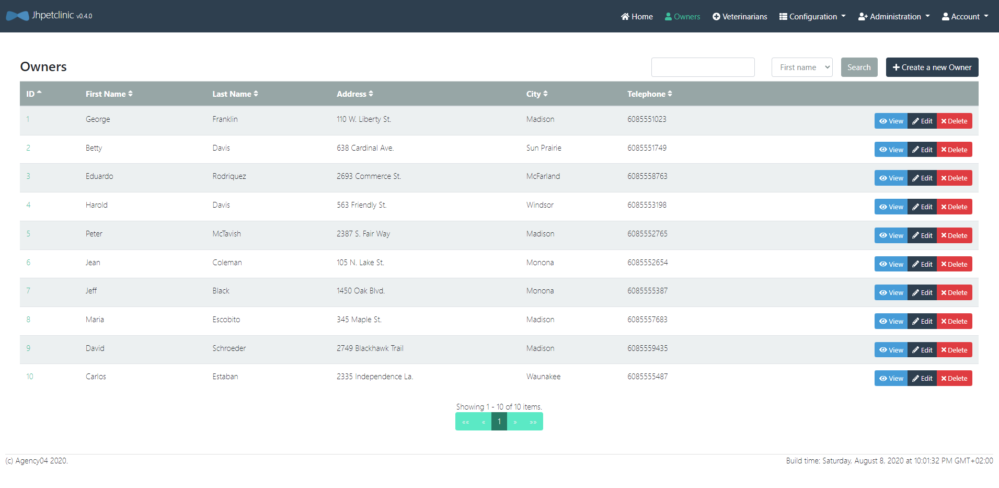

#### Connexion à la base cible

```console
$ lino dc add cible 'postgresql://localhost:5432/jhpetclinic?sslmode=disable' -p -u jhpetclinic
enter password:
successfully added dataconnector
```

```console
$ lino dc list 
{source postgresql://jhpetclinic@localhost:5432/jhpetclinic?sslmode=disable false  { } { }}
{cible postgresql://jhpetclinic@localhost:5432/jhpetclinic?sslmode=disable false  { } { }}
```

```console
$ lino dc ping cible
ping success
```

Si on regarde le fichier `dataconnector.yaml` on peut voir que la base de données `cible` a été ajouté.

```yaml
version: v1
dataconnectors:
  - name: source
    url: postgresql://jhpetclinic@localhost:5432/jhpetclinic?sslmode=disable
    readonly: true
  - name: cible
    url: postgresql://jhpetclinic@localhost:5432/jhpetclinic?sslmode=disable
    readonly: false
```

#### Nettoyage 

On peut nettoyer la base de donnée `cible` à l'aide du paramètre `truncate`.

```console
$ lino push truncate cible </dev/null
```

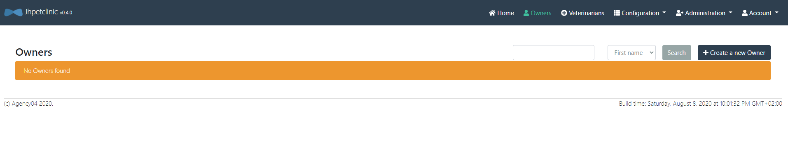

#### Insertion

On peut extraire les données qui se trouvent dans la base de données `source` puis les recharger sur la base de données `cible`.

---------------
> Attention ! Avant il faut générer le fichier `ingress-descriptor.yml` contenant le nom de la table de départ qui sera ici `owners` et de ses relations.

```console
$ lino id create owners
```
Et modifier le paramètre `lookup` de la relation *fk_pets_type_id*.
```yaml
version: v1
IngressDescriptor:
  startTable: owners
  relations:
    - name: fk_pets_type_id
      parent:
        name: types
        # à modifier
        lookup: true
```
---------------

```console
$ lino pull source -l 0 | lino push cible
```

Maintenant, on peut voir appraraître les données dans l'application `cible`. Si on regarde la fiche de *Peter McTavish* on voit qu'il a un seul animal (***George*** le serpent).

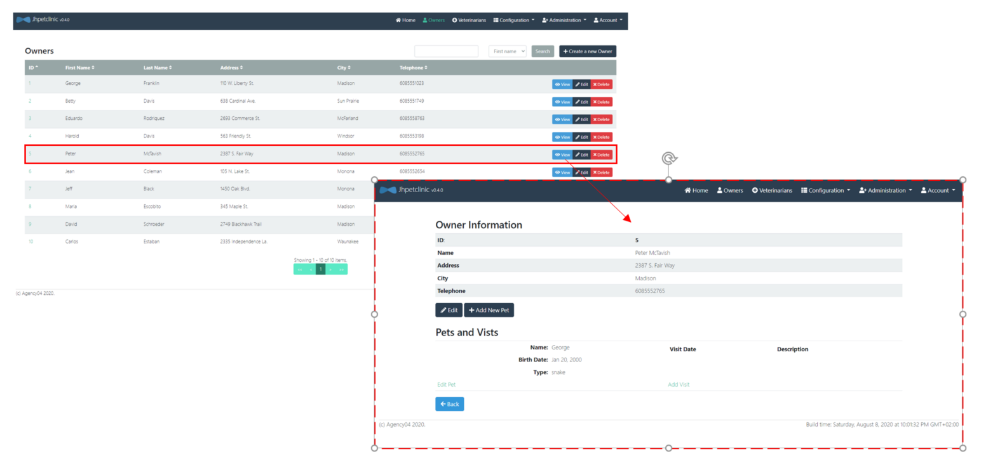

Si on considère le jeu de données suivant (***Bob*** le serpent):

* Sous Linux:

```console
$ cat > bob.jsonl <<EOF
{"birth_date":"2000-11-10T00:00:00Z","fk_visits_pet_id":[],"id":16,"name":"Bob","owner_id":5,"type_id":4}
EOF
```

* Sous Windows:

```powershell
PS> echo '{"birth_date":"2000-11-10T00:00:00Z","fk_visits_pet_id":[],"id":16,"name":"Bob","owner_id":5,"type_id":4}' > bob.jsonl
```

Il est possible de le rajouter dans l'application avec la commande `push`.

```console
$ lino id create pets
$ lino push cible < bob.jsonl
```

Maintenant Bob est disponible dans l'application

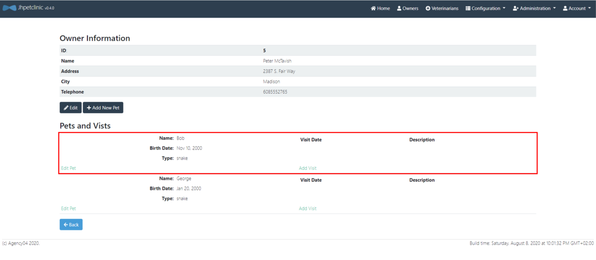

#### Mise à jour (update)

La commande `push` permet également de mettre à jour des enregistrements déjà présents dans la base de données cible.

```
$ lino push update cible < bob.jsonl
```

#### Suppression

La commande `push` permet également de supprimer des données ciblées.

Si on veut supprimer ***Bob*** de l'application (action impossible depuis l'IHM) on reprend le jeu de données de ***Bob***.

```
$ lino push delete cible < bob.jsonl
```

#### Validation/conversion du format des données

Comme pour la commande `pull` (voir paramètre `export`), il est possible de configurer sous quel format se présentent les données dans le flux JSON. Pour cela nous pouvons utilier le paramètre `import` dans le fichier  `table.yaml` au niveau de la définition des colonnes de chaque table.

Dans l'exemple suivant, la colonne `birth_date` de la table `pets` est déclarée comme ayant le format `timestamp` dans le flux JSON. Cela permet à LINO de comprendre quelle conversion doit avoir lieu si la colonne cible en base de données est de type `DATE` par exemple (on affiche ici que la section du fichier qui concerne la table pets, le reste du fichier ne bouge pas) :

```yaml
  - name: pets
    keys:
      - id
    columns:
      - name: birth_date
        import: timestamp
```

Les valeurs disponibles pour la propriété `import` sont :

| Valeur | Effet |
| -- | -- |
| <vide> | Comportement par défaut, LINO tentera d'utiliser directement la valeur lue depuis le JSON auprès du driver de base de données. |
| string | La donnée sera lue depuis JSON au format chaîne de caractères (un plantage aura lieu si la valeur n'est pas au format chaîne de caractères). |
| numeric | La donnée sera lue depuis JSON au format 0.00 ou 0 (format numérique avec ou sans partie décimale). |
| base64 ou binary | La donnée sera lue au format chaîne de caractères, puis décodée en base64, et transmise sous format binaire à la base de données. |
| datetime | La donnée sera lue sous forme de chaîne de caractères représentant une date au format RFC3339 (ex: 2006-01-02T15:04:05Z). |
| timestamp | La donnée sera lue en numeric représentant un timestamp UNIX. |

Il est à noter que certains formats impliquent une conversion de données (le format `binary` par exemple, transforme la données d'une chaîne de caractères vers un tableau d'octets binaire).

Le paramètre `import` permet de contrôler de manière encore plus fine cette conversion implicite. Le format peut en effet être suivi du type sous-jacent à utiliser pour convertir la données. Par exemple `import: binary(int64)` ne convertira pas la donnée en tableau d'octets mais en un entier sur 64bit. Cela permet de gérer des cas particuliers qui peuvent se produire avec certaines bases de données, si le driver s'attend à voir un type différent de celui qui est produit par défaut.

Il est important de bien comprendre que dans cet exemple `import: binary(int64)`, la partie gauche `binary` représente le format dans lequel la donnée est présenté sur le flux JSON, et la partie droite `int64` représente le type dans lequel la valeur est convertie avant d'être envoyée au driver base de données (pour insertion ou mise à jour).

Les types pouvant être utilisés sont :

| Nom | Description |
| -- | -- |
| int | Entier signé sur 32 ou 64 bits selon l'architecture processeur |
| int64 | Entier signé sur 64 bits |
| int32 | Entier signé sur 32 bits |
| int16 | Entier signé sur 16 bits |
| int8 | Entier signé sur 8 bits |
| uint | Entier non signé sur 32 ou 64 bits selon l'architecture processeur |
| uint64 | Entier non signé sur 64 bits |
| uint32 | Entier non signé sur 32 bits |
| uint16 | Entier non signé sur 16 bits |
| uint8 | Entier non signé sur 8 bits |
| float64 | Décimal flottant sur 64 bits |
| float32 | Décimal flottant sur 32 bits |
| bool | Booléen |
| byte | Alias pour uint8 |
| rune | Alias pour uint32 |
| string | Chaîne de caractères |
| []byte | Tableau d'octets (valeur binaire) |
| time.Time | Date / heure |
| json.Number | Alias pour string |

## PIMO

Pour la suite de ce tutoriel, nous souhaitons charger l'environnement de qualification (base de données `cible`) avec des données anonymisées.

L'application de qualification a déjà des données de disponible. L'IHM est disponible [ici](http://localhost:8001).

### Configuration

`pimo` est un utilitaire qui va lire un flux *JSON Line* en entrée. Pour chaque ligne, une série de filtres (pipeline) est appliqué sur l'enregistrement. Chaque enregistrement modifié est écrit sur la sortie standard au format *JSON Line*.

La configuration de `pimo` est réalisée dans un fichier `masking.yml`.

```yaml
# version du fichier de configuration PIMO
version: "1"
# Initialisation du générateur pseudo-aléatoire (optionel)
seed: 42
# Liste ordonnée des masque à appliquer
masking:
  # Premier masque
  - selector:
      # Sélection du champ à modifier
      jsonpath: "age"
    mask:
      # fonction de masque à appliquer
      # Génération d'un nombre aléatoire compris entre min et max inclus
      randomInt:
        min: 18
        max: 90      
```

Vous pouvez retrouver les masques disponible dans `pimo` [ici](https://github.com/CGI-FR/PIMO#possible-masks).

* Sous Linux:

```console
$ cat > data.jsonl <<EOF
{"age": 18}
{"age": 39}
{"age": 52}
EOF
```

* Sous Windows:

```powershell
PS> echo '{"age": 18}' > data.jsonl
PS> echo '{"age": 39}' >> data.jsonl
PS> echo '{"age": 52}' >> data.jsonl
```

```console
$ pimo -c masking.yml < data.jsonl
{"age":79}
{"age":53}
{"age":71}
```

Il n'est pas obligatoire de préciser le fichier de *masking* si celui-ci porte le nom `masking.yml` et se trouve dans le répertoire courant sinon il faudra le préciser avec le paramètre `--config, -c`.

### Générer des données

Pour faire de la sythèse de données, il suffit de masquer tous les champs par un filtre.

La première étape est de créer un fichier de masking (`masking.yml`):

```yaml
version: "1"
seed: 42
masking:
  - selector:
      jsonpath: "id"
    masks:
      - add: ""
      - incremental:
          start: 1
          increment: 1

  - selector:
      jsonpath: "date"
    mask:
      add: ""

  - selector:
      jsonpath: "date"
    mask:
      randDate:
        dateMin: "1970-01-01T00:00:00Z"
        dateMax: "2020-01-01T00:00:00Z"
```

Puis d'utiliser le paramètre `--empty-input` qui permet de générer des données sans aucune entrée, qu'il faut utiliser avec le paramètre `--repeat, -r` qui permet de générer plusieurs sorties pour une entrée.

```console
$ pimo --empty-input -r 3 
{"id":1,"date":"1993-05-24T23:50:53Z"}
{"id":2,"date":"1988-10-05T06:57:23Z"}
{"id":3,"date":"2015-08-17T06:47:42Z"}
```

Il est possible aussi de donner une structure de base à `pimo`, nous allons utiliser un *JSON Line* vide dans le fichier `owners_empty.jsonl`.

```json
{"address":"","city":"","first_name":"","id":1,"last_name":"","telephone":""}
```

L'`id` n'est pas modifié, on choisit de l'incrémenter pour chaque itération. Pour les champs `address`, `city`, `first_name` et `last_name` on utilise des référentiels (voir plus bas, section [Utilisation de référentiels](#ref)).

```yaml
version: "1"
seed: 42
masking:
  - selector:
      jsonpath: "telephone"
    mask:
      regex: "0[1-7]( ([0-9]){2}){4}"

  - selector:
      jsonpath: "adresse_brute"
    masks:
      - add-transient: ""
      - randomChoiceInUri: "file://adresses.csv"

  - selector:
      jsonpath: "address"
    mask:
      template: '{{$a := split ";" (toString .adresse_brute) }}{{$a._2}}, {{$a._4}}'

  - selector:
      jsonpath: "city"
    mask:
      template: '{{$a := split ";" (toString .adresse_brute) }}{{$a._7}}'

  - selector:
      jsonpath: "first_name"
    mask:
      randomChoiceInUri: "pimo://nameFR"

  - selector:
      jsonpath: "last_name"
    mask:
      randomChoiceInUri: "pimo://surnameFR"

  - selector:
      jsonpath: "id"
    mask:
      incremental:
        start: 1
        increment: 1
```

`pimo` remplit les champs avec les masques et permet de générer plusieurs sorties pour une entrée.

* Sous Linux:

```console
$ cat > owners_empty.jsonl <<EOF
heredoc> {"address":"","city":"","first_name":"","id":1,"last_name":"","telephone":""}
heredoc> EOF
```

* Sous Windows:

```powershell
PS> echo '{"address":"","city":"","first_name":"","id":1,"last_name":"","telephone":""}' > owners_empty.jsonl
```

```console
$ pimo --repeat 10 < owners_empty.jsonl 
{"address":"85, Menauton","city":"Betbezer-d'Armagnac","first_name":"Bob","id":1,"last_name":"Muller","telephone":"01 98 40 40 42"}
{"address":"43, Le Bourg","city":"Betbezer-d'Armagnac","first_name":"Anne-Charlotte","id":2,"last_name":"Renard","telephone":"02 45 74 91 82"}
{"address":"33, Nayere","city":"Castelner","first_name":"Pierrette","id":3,"last_name":"Bernard","telephone":"02 10 73 21 43"}
```

au format tableau, 
> Les tableaux sont générés avec la commande `mlr --ijson --omd  cat  owners_empty.jsonl`
> Pour installer `mlr` allez sur [Miller](https://github.com/johnkerl/miller/).

| address | city | first_name | id | last_name | telephone |
| --- | --- | --- | --- | --- | --- |
| 110 W. Liberty St. | Madison | George | 1 | Franklin | 6085551023 |
| 638 Cardinal Ave. | Sun Prairie | Betty | 2 | Davis | 6085551749 |
| 2693 Commerce St. | McFarland | Eduardo | 3 | Rodriquez | 6085558763 |
| 563 Friendly St. | Windsor | Harold | 4 | Davis | 6085553198 |
| 2387 S. Fair Way | Madison | Peter | 5 | McTavish | 6085552765 |
| 105 N. Lake St. | Monona | Jean | 6 | Coleman | 6085552654 |
| 1450 Oak Blvd. | Monona | Jeff | 7 | Black | 6085555387 |
| 345 Maple St. | Madison | Maria | 8 | Escobito | 6085557683 |
| 2749 Blackhawk Trail | Madison | David | 9 | Schroeder | 6085559435 |
| 2335 Independence La. | Waunakee | Carlos | 10 | Estaban | 6085555487 |

Comme le générateur pseudo-aléatoire est configuré avec la même graine les données générées à partir de rien sont identique aux données masquées.

`pimo` peut ainsi être utilisé pour faire des tests de charge de l'application :

```console
$ lino push truncate cible </dev/null
$ lino id create owners
$ cat owners_empty.jsonl | pimo --repeat 100 | lino push truncate cible
```

L'application QL est maintenant chargées avec une volumétrie plus importante.

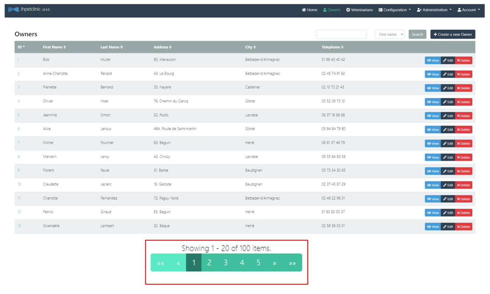

### Modifier des données

Pour commencer, nous allons créer un fichier des propriétaires avec `lino`.

```console
$ lino id set-parent-lookup fk_pets_type_id true  
successfully update relation fk_pets_type_id in ingress descriptor
$ lino pull source -l 0 | lino push truncate cible
$ lino pull cible --limit 0 > owner.jsonl
```

Le fichier `owner.jsonl` contient des informations qui doivent être anonymisée.

```console
$ mlr --ijson --omd  cat  owners.jsonl
```

| address | city | first_name | id | last_name | telephone |
| --- | --- | --- | --- | --- | --- |
| 110 W. Liberty St. | Madison | George | 1 | Franklin | 6085551023 |
| 638 Cardinal Ave. | Sun Prairie | Betty | 2 | Davis | 6085551749 |
| 2693 Commerce St. | McFarland | Eduardo | 3 | Rodriquez | 6085558763 |
| 563 Friendly St. | Windsor | Harold | 4 | Davis | 6085553198 |
| 2387 S. Fair Way | Madison | Peter | 5 | McTavish | 6085552765 |
| 105 N. Lake St. | Monona | Jean | 6 | Coleman | 6085552654 |
| 1450 Oak Blvd. | Monona | Jeff | 7 | Black | 6085555387 |
| 345 Maple St. | Madison | Maria | 8 | Escobito | 6085557683 |
| 2749 Blackhawk Trail | Madison | David | 9 | Schroeder | 6085559435 |
| 2335 Independence La. | Waunakee | Carlos | 10 | Estaban | 6085555487 |

Nous allons ici générer de nouveaux numéro de téléphone, le fichier `masking.yml` est le suivant:

```yaml
version: "1"
seed: 42
masking:
  - selector:
      jsonpath: "telephone"
    mask:
      regex: "0[1-7]( ([0-9]){2}){4}"
```

Ensuite nous appliquons le masque aux données du fichier `owner.jsonl` avec la commande `pimo`:

```console
$ pimo < owners.jsonl > owners_masked.jsonl
```

On obtient le fichier *JSON Line* avec les numéro de téléphone remplacés.

```console
$ mlr --ijson --omd  cat  owners_masked.jsonl
```

| address | city | first_name | id | last_name | telephone |
| --- | --- | --- | --- | --- | --- |
| 110 W. Liberty St. | Madison | George | 1 | Franklin | 01 98 40 40 42 |
| 638 Cardinal Ave. | Sun Prairie | Betty | 2 | Davis | 02 45 74 91 82 |
| 2693 Commerce St. | McFarland | Eduardo | 3 | Rodriquez | 02 10 73 21 43 |
| 563 Friendly St. | Windsor | Harold | 4 | Davis | 03 52 06 73 10 |
| 2387 S. Fair Way | Madison | Peter | 5 | McTavish | 06 37 18 68 68 |
| 105 N. Lake St. | Monona | Jean | 6 | Coleman | 03 84 84 79 80 |
| 1450 Oak Blvd. | Monona | Jeff | 7 | Black | 06 81 37 46 79 |
| 345 Maple St. | Madison | Maria | 8 | Escobito | 06 55 84 83 56 |
| 2749 Blackhawk Trail | Madison | David | 9 | Schroeder | 05 73 34 30 65 |
| 2335 Independence La. | Waunakee | Carlos | 10 | Estaban | 02 37 45 87 29 |

Il est possible de recharger l'environnement  de qualification directement en mode *streaming*.

```console
$ lino pull source --limit 0 | pimo  | lino push truncate cible
```

Les nouveaux numéros de téléphones sont affichés dans l'environnement de qualification.

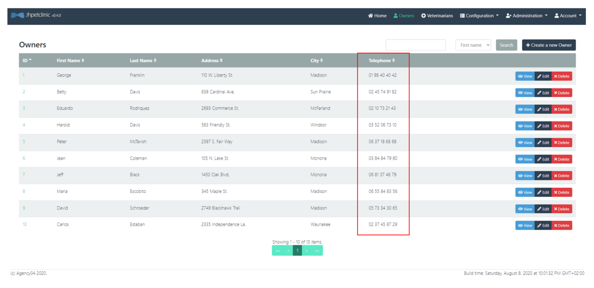

### Utilisation de référentiels <a name = "ref"></a>

#### Référentiels externe

`pimo` permet de réaliser un masquage réaliste en utilisant un référentiel externe.

La première étape est la récupération d'un listing d'adresses françaises.

* Sous Linux:

```console
$ curl https://adresse.data.gouv.fr/data/ban/adresses/latest/csv/adresses-40.csv.gz -o - | gunzip > adresses.csv
```

* Sous Windows:

```powershell
PS> Invoke-WebRequest https://adresse.data.gouv.fr/data/ban/adresses/latest/csv/adresses-40.csv.gz -OutFile adresses.csv
```

Le fichier `adresses.csv` contient des lignes *CSV*.

```csv
id;id_fantoir;numero;rep;nom_voie;code_postal;code_insee;nom_commune;code_insee_ancienne_commune;nom_ancienne_commune;x;y;lon;lat;alias;nom_ld;libelle_acheminement;nom_afnor;source_position;source_nom_voie
40030_xdqd7o_00001;;1;;Le Bourg;40310;40030;Baudignan;;;463951.29;6336689.46;0.051661;44.089542;;;BAUDIGNAN;LE BOURG;inconnue;inconnue
```

Pour chaque enregistrement on rajoute un champ avec le filtre *add*.

```yaml
  - selector:
      # Sélection du champ à modifier
      jsonpath: "adresse_brute"
    mask:
      # fonction de masque à appliquer
      add: ""
```

Ce filtre modifie la structure du *JSON line* en rajoutant un nouveau champ (`"adresse_brute": ""`).
`pimo` est capable de faire un tir aléatoire dans un fichier pour chaque enregistrement.

```yaml
  - selector:
      # Sélection du champ à modifier
      jsonpath: "adresse_brute"
    mask:
      # fonction de masque à appliquer
      randomChoiceInUri: "file://adresses.csv"
```

`pimo` propose un moteur de template pour réaliser des transformations complexes.

```yaml
  - selector:
      # Sélection du champ à modifier
      jsonpath: "address"
    mask:
      # fonction de masque à appliquer
      template: '{{$a := split ";" (toString .adresse_brute) }}{{$a._2}}, {{$a._4}}'
```

Dans notre cas nous voulons découper la ligne *CSV* et concaténer la colonne 2 et 4.

La colonne 7 va être utilisé pour la ville.

```yaml
  - selector:
      # Sélection du champ à modifier
      jsonpath: "city"
    mask:
      # fonction de masque à appliquer
      template: '{{$a := split ";" (toString .adresse_brute) }}{{$a._7}}'
```

Le champ `adresse_brute` n'est pas nécessaire dans le résultat, le filtrer `remove` est utilisé pour le supprimer.

```yaml
  - selector:
      # Sélection du champ à modifier
      jsonpath: "adresse_brute"
    mask:
      # fonction de masque à appliquer
      remove: true
```

On obtient des lignes avec des adresses existantes.

| address | city | first_name | id | last_name | telephone |
| --- | --- | --- | --- | --- | --- |
| 92, Rue de Francillon | Biscarrosse | George | 1 | Franklin | 05 30 85 92 14 |
| 1687, Route de Saas | Rivière-Saas-et-Gourby | Betty | 2 | Davis | 06 16 08 56 96 |
| 1050, Route du Hallot | Perquie | Eduardo | 3 | Rodriquez | 06 62 38 83 99 |
| 42, Avenue Etienne Castaings | Ondres | Harold | 4 | Davis | 02 41 24 37 32 |
| 11, Allée du Champ Ferme | Saugnacq-et-Muret | Peter | 5 | McTavish | 07 09 88 18 00 |
| 30, Avenue Debussy | Capbreton | Jean | 6 | Coleman | 01 37 31 86 02 |
| 16, Clos des Vignerons | Saint-Martin-de-Hinx | Jeff | 7 | Black | 01 39 86 93 80 |
| 80, Impasse Georges Sabde | Saint-Pierre-du-Mont | Maria | 8 | Escobito | 01 62 46 20 07 |
| 147, Rue des Roses | Léon | David | 9 | Schroeder | 01 38 01 76 12 |
| 53, Rue des Mûriers | Biscarrosse | Carlos | 10 | Estaban | 06 91 52 79 43 |

On peut également utiliser le masque `add-transient` qui est la combinaison du masque `add` et du masque `remove`. 

```yaml
  - selector:
      # Sélection du champ à modifier
      jsonpath: "adresse_brute"
    mask:
      # fonction de masque à appliquer
      add-transient: ""
```

Le champ **adresse_brute** est ajouter dans chaque *JSON Line* et contient la valeur "" et il sera supprimer à la fin du masking, il n'apparaitra pas dans la sortie finale.

#### Référentiels inclus dans PIMO

Pour simplifier la configuration, `pimo` embarque une collection de référentiels souvent utilisés.

```yaml
  - selector:
      jsonpath: "first_name"
    mask:
      # Un prénom français
      randomChoiceInUri: "pimo://nameFR"
  - selector:
      jsonpath: "last_name"
    mask:
      # Un nom français
      randomChoiceInUri: "pimo://surnameFR"
```
Toutes les données sont masquées et on peut l'utilisé sur un environnement de test.

| address | city | first_name | id | last_name | telephone |
| --- | --- | --- | --- | --- | --- |
| 92, Rue de Francillon | Biscarrosse | Vincent | 1 | Richard | 05 30 85 92 14 |
| 1687, Route de Saas | Rivière-Saas-et-Gourby | Aude | 2 | Giraud | 06 16 08 56 96 |
| 1050, Route du Hallot | Perquie | Viviane | 3 | Perez | 06 62 38 83 99 |
| 42, Avenue Etienne Castaings | Ondres | Roberte | 4 | Masson | 02 41 24 37 32 |
| 11, Allée du Champ Ferme | Saugnacq-et-Muret | Ambroise | 5 | Lefevre | 07 09 88 18 00 |
| 30, Avenue Debussy | Capbreton | Alphonse | 6 | Dumont | 01 37 31 86 02 |
| 16, Clos des Vignerons | Saint-Martin-de-Hinx | Ursula | 7 | Duval | 01 39 86 93 80 |
| 80, Impasse Georges Sabde | Saint-Pierre-du-Mont | Remi | 8 | Brunet | 01 62 46 20 07 |
| 147, Rue des Roses | Léon | Melchior | 9 | Francois | 01 38 01 76 12 |
| 53, Rue des Mûriers | Biscarrosse | Sophie | 10 | Clement | 06 91 52 79 43 |

## Parsing XML dans PIMO

Depuis la version `1.20.0` de PIMO, il est possible de traiter des fichiers XML.

PIMO conserve l'indentation et les commentaires du fichier, mais applique des modifications aux balises ciblées.

Voici un exemple de fichier XML:

```xml
<?xml version="1.0" encoding="UTF-8"?>
<taxes>
    <account location="New York">
        <name gender="male" age="23">Doe John</name>
        <account_number>12345</account_number>
    </account>
</taxes>
```

Si la balise ciblée est `account`, PIMO va lire un flux *XML* en entrée jusqu'à ce qu'il trouve la balise `account`. Si son contenue est converti en format *JSON*, voici le résultat attendu en format JSON :

```json
{"@location":"New York", "name":"Doe John","name@gender":"male", "name@age":"23", "account_number":"12345"}
```

La configuration est également réalisée dans un fichier `YAML`. Selon le `jsonpath`, PIMO va trouver la clé adaptée, et masquer sa valeur. 

Pour suivre ce tutoriel, préparez les deux fichiers YAML suivants :

`masking_agence.yml`

```yaml
version: "1"
seed: 42

masking:
  - selector:
        # Sélection de nom de balise à masquer
        jsonpath: "numero_agence"  
    mask:
        # Fonction de masque à appliquer
        # Génération de 4 chiffres aléatoires
        # Dans XML, on n'accepte que des données du type chaîne de caractères. Pour les autres types, il faut passer par un masque 'template' pour le transformer en chaîne de caractères.
        template: '{{MaskRegex "[0-9]{4}$"}}'   
```

`masking_compte.yml`

```yaml
version: "1"
seed: 42

masking:
  - selector:
        # Sélection du nom d'attribut d'élement parent à modifier
        jsonpath: "@type" 
    mask:
        # Fonction de masque à appliquer
        # Sélection d'un valeur aléatoire parmi 3 choix
        randomChoice:
         - "classique"
         - "épargne"
         - "sécurité"
  - selector:
        # Sélection du nom d'attribut et du nom d'élement enfant à modifier
        jsonpath: "nom@age"
    masks:
        # Fonction de masque à appliquer
        # Génération d'un nombre aléatoire compris entre min et max inclus
      - randomInt:
            min: 18
            max: 95
        # Le symbole '@' n'est pas accepté par GO, donc nous devons utiliser un index dans le template pour convertir un entier en chaîne de caractères.
      - template: "{{index . \"nom@age\"}}"
```

Vous pouvez retrouver les masques disponible dans `pimo` [ici](https://github.com/CGI-FR/PIMO#possible-masks).

Pour masquer les valeurs des attributs, suivez les règles pour définir votre choix dans `jsonpath` :

* Pour les attributs de la balise parent, utilisez : `@nomAttribut` dans `jsonpath`.
* Pour les attributs de la balise enfant, utilisez : `nomBaliseEnfant@nomAttribut` dans `jsonpath`.

A notez aussi:

* Dans XML, On accepte que des données du type `String`. Pour les autres types, il faut passer par un masque `template` pour le transformer en chaîne de caractères.
* Ces balises ciblées ne doivent contenir aucune autre balise imbriquée.
* Le symbole `@` n'est pas accepté par GO, donc si vous avez généré une valeur en dehors de type `String`. Pour la convertir, il faut utiliser un index dans le `template`.

Pour suivre ce tutoriel, voici le fichier XML à créer:

`data.xml`

```xml
<?xml version="1.0" encoding="UTF-8"?>
<impôts>
    <agence>
        <nom>Agence NewYork</nom>               <!-- donnée à conserver   -->
        <numero_agence>0032</numero_agence>     <!-- donnée à masquer     -->
    </agence>
    <compte  type="classique">                  <!-- attribute à masquer  -->
        <nom age="25">Doe</nom>                 <!-- attribute à masquer  -->
        <numero_compte>12345</numero_compte>    <!-- donnée à conserver   -->
        <revenu_annuel>50000</revenu_annuel>    <!-- donnée à conserver   -->
    </compte >
    <compte  type="épargne">                    <!-- attribute à masquer  -->
        <nom age="50">Smith</nom>               <!-- attribute à masquer  -->
        <numero_compte>67890</numero_compte>    <!-- donnée à conserver   -->
        <revenu_annuel>60000</revenu_annuel>    <!-- donnée à conserver   -->
    </compte >
</impôts>
```

Dans cet exemple, vous pouvez masquer la valeur de `numero_agence` dans la balise `agence` et les valeurs des attributs `type` et `age` dans la balise `compte` en utilisant la commande suivante :

```bash
  cat data.xml | pimo xml --subscriber agence=masking_agence.yml --subscriber compte=masking_compte.yml > maskedData.xml
```

* `cat data.xml` définit le fichier d'entré.
* `pimo xml` indique qu'il s'agit d'un fichier XML à traiter.
* `--subscriber agence` spécifie la sélection du nom de la balise parent à masquer.
* `=masking_agence.yml` suit le nom de la balise pour sélectionner la configuration de masque appropriée.
* `--subscriber compte=masking_compte.yml` Vous pouvez choisir plusieurs balises parent à masquer avec des configurations différentes dans une seule commande. 
* `> maskedData.xml` définit le nom du fichier de sortie. 

Après avoir exécuté la commande avec la configuration correcte, voici le résultat attendu dans le fichier `maskedData.xml` :

`maskedData.xml`

```xml
<?xml version="1.0" encoding="UTF-8"?>
<impôts>
    <agence>
        <nom>Agence NewYork</nom>
        <numero_agence>2308</numero_agence>
    </agence>
    <compte type="épargne">
        <nom age="33">Doe</nom>
        <numero_compte>12345</numero_compte>
        <revenu_annuel>50000</revenu_annuel>
    </compte>
    <compte type="épargne">
        <nom age="47">Smith</nom>
        <numero_compte>67890</numero_compte>
        <revenu_annuel>60000</revenu_annuel>
    </compte>
</impôts>
```

## Gestion des erreurs dans LINO - PIMO

Les logs de `lino` et `pimo` sont écrit sur la sortie standard d'erreur. Même si on utilise des pipes unix `|` pour chaîner les commandes les log sont toujours disponible dans la console.

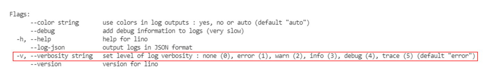

```console
$ lino id create pets 
$ lino push truncate cible </dev/null
$ lino pull source -l 0 | lino push cible
multiple errors: [pq: insert or update on table "pets" violates foreign key constraint "fk_pets_type_id" (No error capture configured)], [pq: Could not complete operation in a failed transaction], [<nil>]
```

Pour gérer les erreurs on utilise

```console
lino pull source -l 0 | lino push cible -v5
```

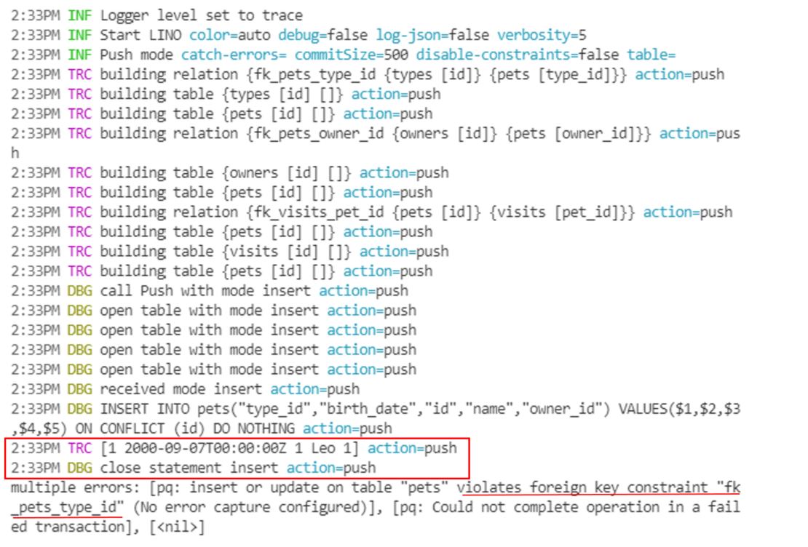

```console
$ lino id create owners
successfully created ingress descriptor
$ lino id set-parent-lookup fk_pets_type_id true 
successfully update relation fk_pets_type_id in ingress descriptor
$ lino pull source -l 0 | lino push cible -v3
```

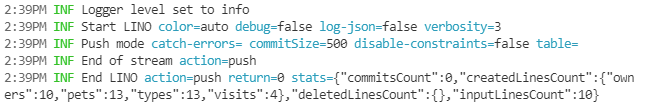

### Redirection des erreurs

```console
lino pull -f id=3 source -v3 | jq 
lino pull -f id=3 source -v5 --log-json 2> error.json
lino pull -f id=3 source -v5 --log-json 2> >(tee error.json)
```

## SIGO

### Installation

Vous pouvez récupérer le binaire de `sigo` sur la page [CGI-FR/SIGO/releases](https://github.com/CGI-FR/SIGO/releases), en choisissant la version et l'environnement qui convient.

* Sous Linux

```console
$ wget <url>/<file>.tar.gz --output-document sigo.tar.gz
$ tar xzf sigo.tar.gz
$ sigo --version
```

* Sous Windows 

```powershell
PS> Invoke-WebRequest <url>/<file>.tar.gz -OutFile sigo.tar.gz
PS> Save-Module -Name 7Zip4Powershell -Path .
PS> Import-Module .\7Zip4Powershell\2.1.0\7Zip4Powershell.psd1
PS> Expand-7Zip sigo.tar.gz .
PS> Expand-7Zip sigo.tar .
PS> $env:Path += ";."
PS> sigo --version
```

Vérifier l'installation avec la commande `sigo --help`.

### Utilisation de SIGO avec des données mixtes

Dans ce tutoriel, nous allons faire l'anonymisation d'un jeu de données générer par `pimo`.
Supposons que nous avons dans un fichier des caractéristiques sur des individus tels que l'âge, le poids, la taille, la région, un attribut indiquant si la personne fume ou non et si elle est malade (donnée sensible).

#### Génération de données avec PIMO

```console
pimo -c masking.yml --empty-input -r 100 > data.json
```

**masking.yml**
```yaml
version: "1"
seed: 42
masking:
  - selector:
      jsonpath: "age"
    masks:
      - add : ""
      - randomInt:
         min: 18
         max: 95

  - selector:
      jsonpath: "poids"
    masks:
      - add : ""    
      - randomDecimal:
         min: 50
         max: 100
         precision: 2

  - selector:
      jsonpath: "taille"
    masks:
      - add : ""
      - randomDecimal:
         min: 1.40
         max: 2.00
         precision: 2

  - selector:
      jsonpath: "departement"
    masks:
      - add : ""
      - randomChoice:
        - "Auvergne-Rhône-Alpes"
        - "Bourgogne-Franche-Comté"
        - "Bretagne"
        - "Centre-Val de Loire"
        - "Corse"
        - "Grand-Est"
        - "Hauts-de-France"
        - "Île-de-France"
        - "Normandie"
        - "Nouvelle-Aquitaine"
        - "Occitanie"
        - "Pays de Loire"
        - "Provence-Alpes-Côte d'Azur"

  - selector:
      jsonpath: "fume"
    masks:
      - add : ""
      - randomChoice:
         - "oui"
         - "non"

  - selector:
      jsonpath: "malade"
    masks:
      - add : ""
      - randomChoice:
        - "oui"
        - "non"
```

**data.json**
```json
{"age":25,"poids":90.98,"taille":1.43,"departement":"Corse","fume":"non","malade":"oui"}
{"age":70,"poids":54.56,"taille":1.96,"departement":"Occitanie","fume":"non","malade":"non"}
{"age":58,"poids":77.71,"taille":1.64,"departement":"Provence-Alpes-Côte d'Azur","fume":"oui","malade":"oui"}
{"age":19,"poids":75.69,"taille":1.59,"departement":"Provence-Alpes-Côte d'Azur","fume":"oui","malade":"oui"}
{"age":70,"poids":81.77,"taille":1.72,"departement":"Corse","fume":"oui","malade":"non"}
```

`sigo` est capable d'anonymiser des jeux de données composés essentiellement de flottants. Pour pouvoir anonymiser un jeu de données comportant des attributs catégoriels comme dans l'exemple ci-dessus, il faut préalablement effectuer une conversion pour transformer les attributs textuels en flottant. Cette manipulation est très facile avec `pimo`.

#### Conversion avec PIMO 

Nous allons utiliser la notion de cache dans `pimo`, ce qui va nous permettre de créer un dictionnaire *clé-valeur* ou la **clé** sera la valeur de l'attribut catégoriel et la **valeur** sera le flottant correspondant à la clé, que l'on gardera en mémoire afin de faire la conversion inverse une fois l'anonymisation faite.

**cache.yml**
```yaml
version: "1"
seed: 42
masking:
  - selector:
      jsonpath: "departement"
    mask:
      incremental:
        start: 1
        increment: 1
    cache: "cacheDepartement"

  - selector:
      jsonpath: "fume"
    mask:
      incremental:
        start: 1
        increment: 1
    cache: "cacheFume"

caches:
  cacheDepartement:
    unique: true
    reverse: false
  cacheFume:
    unique: true
    reverse: false
```

```console
pimo -c cache.yml --dump-cache cacheDepartement=departement.json <<EOF
{"departement": "Auvergne-Rhône-Alpes"}
{"departement": "Bourgogne-Franche-Comté"}
{"departement": "Bretagne"}
{"departement": "Centre-Val de Loire"}
{"departement": "Corse"}
{"departement": "Grand-Est"}
{"departement": "Hauts-de-France"}
{"departement": "Île-de-France"}
{"departement": "Normandie"}
{"departement": "Nouvelle-Aquitaine"}
{"departement": "Occitanie"}
{"departement": "Pays de Loire"}
{"departement": "Provence-Alpes-Côte d'Azur"}
EOF
```

**departement.json**
```json
{"key":"Normandie","value":9}
{"key":"Bourgogne-Franche-Comté","value":2}
{"key":"Bretagne","value":3}
{"key":"Hauts-de-France","value":7}
{"key":"Grand-Est","value":6}
{"key":"Île-de-France","value":8}
{"key":"Nouvelle-Aquitaine","value":10}
{"key":"Occitanie","value":11}
{"key":"Pays de Loire","value":12}
{"key":"Auvergne-Rhône-Alpes","value":1}
{"key":"Centre-Val de Loire","value":4}
{"key":"Corse","value":5}
{"key":"Provence-Alpes-Côte d'Azur","value":13}
```

```console
pimo -c cache.yml --dump-cache cacheFume=fume.json <<EOF
{"fume": "oui"}
{"fume": "non"}
EOF
```

**fume.json**
```json
{"key":"oui","value":1}
{"key":"non","value":2}
```

```console
pimo --load-cache cacheDepartement=departement.json --load-cache cacheFume=fume.json -c transpose.yml < data.json > data_transpose.json
```

**transpose.yml**
```yaml
version: "1"
seed: 42
masking:
  - selector:
      jsonpath: "departement"
    mask:
      fromCache: "cacheDepartement"

  - selector:
      jsonpath: "fume"
    mask:
      fromCache: "cacheFume"

caches:
  cacheDepartement:
    unique: true
    reverse: false
  cacheFume:
    unique: true
    reverse: false
```

**data_transpose.json**
```json
{"age":25,"poids":90.98,"taille":1.43,"departement":5,"fume":2,"malade":"oui"}
{"age":70,"poids":54.56,"taille":1.96,"departement":11,"fume":2,"malade":"non"}
{"age":58,"poids":77.71,"taille":1.64,"departement":13,"fume":1,"malade":"oui"}
{"age":19,"poids":75.69,"taille":1.59,"departement":13,"fume":1,"malade":"oui"}
{"age":70,"poids":81.77,"taille":1.72,"departement":5,"fume":1,"malade":"non"}
```

Une fois que notre jeu de donnée est entièrement en flottant (mis à part la donnée sensible, mais cela n'est pas dérangeant puisque `sigo` ne modifiera pas cette donnée). Nous pouvons passer à l'anonymisation.

#### Anonymisation avec SIGO

```console
sigo -q age,poids,taille,departement,fume -s malade -k 4 -l 2 -a meanAggregation < data_transpose.json > data_sigo.json
```

**data_sigo.json**
```json
{"age":32,"poids":58.81,"taille":1.51,"departement":4,"fume":1.5,"malade":"oui"}
{"age":32,"poids":58.81,"taille":1.51,"departement":4,"fume":1.5,"malade":"oui"}
{"age":32,"poids":58.81,"taille":1.51,"departement":4,"fume":1.5,"malade":"non"}
{"age":32,"poids":58.81,"taille":1.51,"departement":4,"fume":1.5,"malade":"oui"}
{"age":48,"poids":66.07,"taille":1.56,"departement":7.25,"fume":1.75,"malade":"oui"}
{"age":48,"poids":66.07,"taille":1.56,"departement":7.25,"fume":1.75,"malade":"non"}
{"age":48,"poids":66.07,"taille":1.56,"departement":7.25,"fume":1.75,"malade":"non"}
{"age":48,"poids":66.07,"taille":1.56,"departement":7.25,"fume":1.75,"malade":"non"}
```

#### Transformation inverse avec PIMO

On veut pouvoir retrouver nos données avec le même format que les données originales, pour ce faire nous allons utiliser le paramètre *reverse* de l'option `cache`.

**reverse.yml**
```yaml
version: "1"
seed: 42
masking:
  - selector:
      jsonpath: "departement"
    masks:
      # arrondir la valeur de l'attribut
      - template: "{{round (toString .departement) 0 }}" # string
      # changer le type (number en float64) 
      - fromjson: "departement" # float64
      # retrouver la clé correspondant à la valeur dans le fichier departement.json
      - fromCache: "cacheDepartement"

  - selector:
      jsonpath: "fume"
    masks:
      - template: "{{round (toString .fume) 0 }}"
      - fromjson: "fume"
      - fromCache: "cacheFume"

caches:
  cacheDepartement:
    unique: false
    reverse: true
  cacheFume:
    unique: false
    reverse: true
```

```console
pimo --load-cache cacheDepartement=departement.json --load-cache cacheFume=fume.json -c reverse.yml < data_sigo.json > data_out.json
```

**data_out.json**
```json
{"age":32,"poids":58.81,"taille":1.51,"departement":"Centre-Val de Loire","fume":"non","malade":"oui"}
{"age":32,"poids":58.81,"taille":1.51,"departement":"Centre-Val de Loire","fume":"non","malade":"oui"}
{"age":32,"poids":58.81,"taille":1.51,"departement":"Centre-Val de Loire","fume":"non","malade":"non"}
{"age":32,"poids":58.81,"taille":1.51,"departement":"Centre-Val de Loire","fume":"non","malade":"oui"}
{"age":48,"poids":66.07,"taille":1.56,"departement":"Hauts-de-France","fume":"non","malade":"oui"}
{"age":48,"poids":66.07,"taille":1.56,"departement":"Hauts-de-France","fume":"non","malade":"non"}
{"age":48,"poids":66.07,"taille":1.56,"departement":"Hauts-de-France","fume":"non","malade":"non"}
{"age":48,"poids":66.07,"taille":1.56,"departement":"Hauts-de-France","fume":"non","malade":"non"}
```

### Utilisation du fichier de configuration pour anonymiser

Il est également possible d'utiliser **SIGO** à l'aide d'un fichier de configuration pour renseigner les paramètres de l'anonymisation.

**sigo.yml**
```yaml
version: "1"

kAnonymity: 4
lDiversity: 2
sensitives:
  - malade
aggregation: meanAggregation
rules:
  - name: age
  - name: poids
  - name: taille
  - name: departement
  - name: fume
```

```console
sigo -c sigo.yml < data_transpose.json > data_sigo.json
```

**data_sigo.json**
```json
{"age":32,"poids":58.81,"taille":1.51,"departement":4,"fume":1.5,"malade":"oui"}
{"age":32,"poids":58.81,"taille":1.51,"departement":4,"fume":1.5,"malade":"oui"}
{"age":32,"poids":58.81,"taille":1.51,"departement":4,"fume":1.5,"malade":"non"}
{"age":32,"poids":58.81,"taille":1.51,"departement":4,"fume":1.5,"malade":"oui"}
{"age":48,"poids":66.07,"taille":1.56,"departement":7.25,"fume":1.75,"malade":"oui"}
{"age":48,"poids":66.07,"taille":1.56,"departement":7.25,"fume":1.75,"malade":"non"}
{"age":48,"poids":66.07,"taille":1.56,"departement":7.25,"fume":1.75,"malade":"non"}
{"age":48,"poids":66.07,"taille":1.56,"departement":7.25,"fume":1.75,"malade":"non"}
```